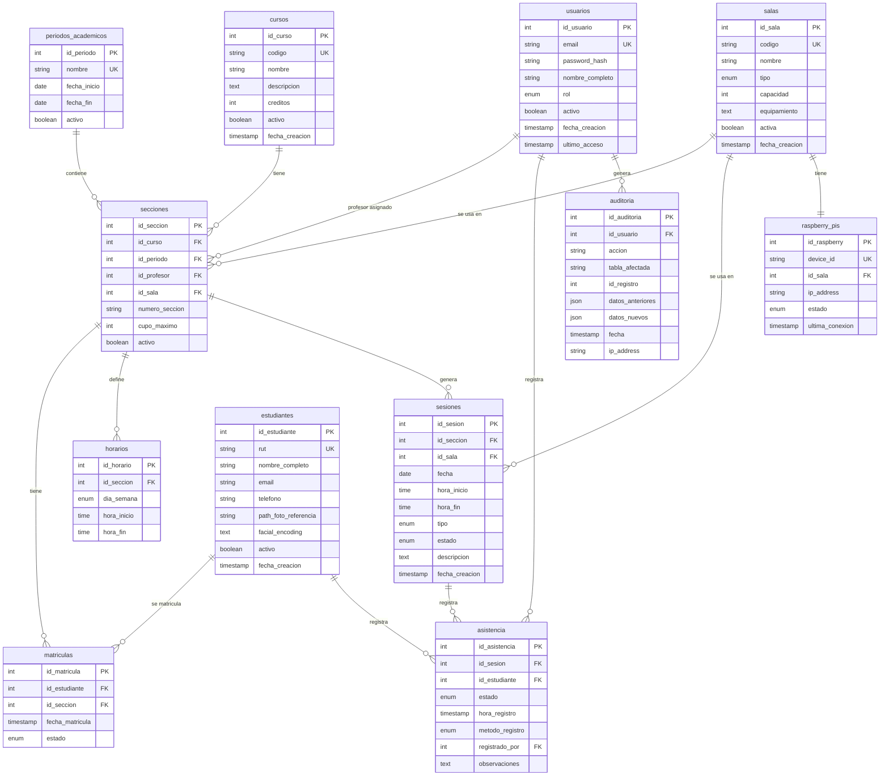

# Plan de Proyecto: Sistema de Gestión Académica y Asistencia Facial v2.0

**Fecha:** Noviembre 2025
**Versión:** 2.0
**Estado:** Planificación

---

## 📋 Tabla de Contenidos

1. [Resumen Ejecutivo](#resumen-ejecutivo)
2. [Objetivos del Proyecto](#objetivos-del-proyecto)
3. [Alcance](#alcance)
4. [Arquitectura del Sistema](#arquitectura-del-sistema)
5. [Modelo de Datos](#modelo-de-datos)
6. [Diseño de API](#diseño-de-api)
7. [Especificaciones Funcionales](#especificaciones-funcionales)
8. [Stack Tecnológico](#stack-tecnológico)
9. [Plan de Implementación](#plan-de-implementación)
10. [Consideraciones de Seguridad](#consideraciones-de-seguridad)
11. [Roadmap Futuro](#roadmap-futuro)

---

## 1. Resumen Ejecutivo

### 1.1 Contexto

El proyecto actual (`facial-attendance-system`) es un MVP funcional con reconocimiento facial para registro de asistencia. Sin embargo, carece de:
- Sistema de autenticación y roles
- Gestión estructurada de cursos, secciones y horarios
- Períodos académicos
- Reportería y auditoría
- Interfaz para múltiples tipos de usuarios

### 1.2 Objetivo General

Desarrollar un **Sistema de Gestión Académica Integral** que permita:
- Administrar la estructura académica completa (periodos, cursos, secciones, horarios, salas)
- Gestionar usuarios con diferentes roles y permisos (Coordinador, Profesor, Estudiante)
- Registrar asistencia mediante reconocimiento facial automatizado y registro manual
- Generar reportes y estadísticas de asistencia
- Auditar cambios críticos en el sistema

### 1.3 Stakeholders

**Coordinador (Administrador):**
- Permisos completos CRUD sobre todas las entidades
- Gestión de usuarios, estructura académica, salas, períodos
- Acceso a reportes globales
- Capacidad de corregir asistencia histórica

**Profesor:**
- Ver solo sus secciones asignadas
- Ver estudiantes matriculados en sus secciones
- Registrar asistencia manualmente (backup del sistema facial)
- Ver reportes de sus secciones
- No puede editar asistencia histórica

**Estudiante:**
- Ver su propia asistencia en todas sus secciones
- Ver estadísticas personales (% asistencia por ramo)
- Ver próximas clases
- Ver horario completo de sus ramos
- Recibir notificaciones de asistencia registrada

---

## 2. Objetivos del Proyecto

### 2.1 Objetivos de Negocio

1. **Automatizar el registro de asistencia** reduciendo el tiempo de los profesores en esta tarea
2. **Mejorar la precisión** eliminando errores de registro manual
3. **Proporcionar visibilidad en tiempo real** del estado de asistencia
4. **Facilitar la toma de decisiones** mediante reportes y estadísticas
5. **Prevenir fraude** mediante detección de liveness (anti-spoofing)
6. **Auditar cambios críticos** para trazabilidad completa

### 2.2 Objetivos Técnicos

1. **Migrar de arquitectura simple a sistema robusto** con separación clara de responsabilidades
2. **Implementar autenticación y autorización** segura con JWT
3. **Optimizar el reconocimiento facial** con activación/desactivación automática
4. **Escalar el sistema** para soportar múltiples salas, secciones y períodos académicos
5. **Proporcionar API RESTful** bien documentada para futuras integraciones
6. **Mantener alta disponibilidad** durante horarios de clases

### 2.3 Métricas de Éxito

**A 3 meses del lanzamiento:**
- 90%+ de profesores usan el sistema regularmente
- <2 minutos promedio para registrar asistencia completa de una sección
- 95%+ de uptime durante horario académico
- <3 segundos tiempo de carga de reportes
- 85%+ de satisfacción de usuarios
- <5 bugs críticos reportados

---

## 3. Alcance

### 3.1 Alcance del MVP (Versión 1.0)

**Incluido:**

✅ **Autenticación y Autorización:**
- Login/logout con JWT
- 3 roles: Coordinador, Profesor, Estudiante
- Control de acceso por endpoint

✅ **Gestión de Estructura Académica:**
- Periodos académicos (semestres)
- Cursos (asignaturas base)
- Secciones (instancia de curso en un período con profesor asignado)
- Horarios recurrentes por sección
- Sesiones específicas (clases individuales)
- Validación de conflictos (sala ocupada, profesor ocupado)

✅ **Gestión de Salas:**
- CRUD de salas con tipo, capacidad, equipamiento
- Asociación de Raspberry Pi por sala
- Validación de disponibilidad

✅ **Gestión de Usuarios:**
- CRUD de coordinadores y profesores
- CRUD de estudiantes (individual + import Excel básico)
- Upload de foto facial por estudiante
- Matrícula de estudiantes en secciones

✅ **Registro de Asistencia:**
- Reconocimiento facial automatizado
- Activación/desactivación automática de cámaras según horario
- Detección de liveness (anti-spoofing con detección de parpadeo)
- Registro manual por profesor
- Estados: Presente, Ausente, Tarde, Justificado
- Marcado automático como "ausente" al finalizar sesión
- Edición de asistencia por coordinador (últimas 2 semanas)

✅ **Reportes:**
- Asistencia individual del estudiante
- Asistencia de toda la sección
- Lista de estudiantes en riesgo (>3 ausencias)
- Exportación a Excel

✅ **Notificaciones:**
- Notificaciones in-app (popup en navegador)
- Asistencia registrada (para estudiante)
- Recordatorio de clase 10 minutos antes (profesor + estudiantes)

✅ **Auditoría:**
- Log de ediciones de asistencia
- Log de creación/edición de usuarios
- Vista simple de auditoría

✅ **Frontend:**
- Aplicación web responsive con React + TypeScript
- Dashboard por rol
- CRUD de todas las entidades
- Calendario de horarios y sesiones
- Panel de asistencia para profesor
- Vista de asistencia para estudiante

✅ **Infraestructura:**
- Docker para desarrollo y producción
- Comando CLI para crear superuser
- Scripts de migración de BD
- Documentación básica

### 3.2 Fuera del Alcance del MVP (Fase 2)

⏭️ **Funcionalidades Avanzadas:**
- Gestión automática de feriados (API de feriados)
- Sesión de fotos masiva
- Import Excel avanzado con preview y validaciones
- Exportación a PDF diseñados
- Notificación automática de 3+ ausencias consecutivas
- Estadísticas avanzadas con gráficos y tendencias
- Justificación con upload de documentos
- Log detallado de intentos de spoofing con alertas
- Auditoría con búsqueda avanzada
- Panel de monitoreo de Raspberry Pis
- App móvil nativa (Android/iOS)
- Integración con LMS (Moodle, Canvas)
- Módulo de evaluaciones (notas)

⏭️ **Infraestructura Avanzada:**
- CI/CD completo
- Monitoreo con Grafana/Prometheus
- Rate limiting robusto
- Caché con Redis
- Backup automático programado
- Tests automatizados (cobertura >80%)

---

## 4. Arquitectura del Sistema

### 4.1 Arquitectura General

```
┌─────────────────────────────────────────────────────────┐
│                FRONTEND WEB (React + TS)                │
│  ┌──────────────┐  ┌──────────────┐  ┌──────────────┐  │
│  │ Coordinador  │  │  Profesor    │  │  Estudiante  │  │
│  │  Dashboard   │  │  Dashboard   │  │  Dashboard   │  │
│  └──────────────┘  └──────────────┘  └──────────────┘  │
└────────────────────────┬────────────────────────────────┘
                         │ HTTPS (REST API + WebSocket)
                         ↓
┌─────────────────────────────────────────────────────────┐
│              BACKEND API (FastAPI)                       │
│  ┌──────────┐  ┌──────────┐  ┌──────────┐              │
│  │   Auth   │  │ Business │  │  Facial  │              │
│  │  Service │  │  Logic   │  │Recognition│              │
│  └──────────┘  └──────────┘  └──────────┘              │
│  ┌──────────┐  ┌──────────┐  ┌──────────┐              │
│  │ WebSocket│  │Scheduler │  │ Reports  │              │
│  │  Manager │  │  Service │  │  Service │              │
│  └──────────┘  └──────────┘  └──────────┘              │
└────────────────────────┬────────────────────────────────┘
                         │
         ┌───────────────┴───────────────┐
         ↓                               ↓
┌──────────────────┐          ┌──────────────────┐
│   MySQL 8.0      │          │  Raspberry Pis   │
│   (Database)     │          │  (1 por sala)    │
│                  │          │  - Cliente Python│
│  - 13 tablas     │          │  - Cámara USB    │
│  - Relaciones    │          │  - Face Detection│
│  - Índices       │          └──────────────────┘
└──────────────────┘
```

### 4.2 Componentes Principales

#### 4.2.1 Frontend (React)

**Responsabilidades:**
- Renderizar UI según rol del usuario
- Comunicación con API backend (REST + WebSocket)
- Validaciones de formularios
- Gestión de estado local (Zustand/Redux)
- Notificaciones en tiempo real

**Módulos:**
- `auth/`: Login, logout, refresh token
- `admin/`: Gestión de usuarios, estructura académica, salas
- `professor/`: Panel de asistencia, reportes de secciones
- `student/`: Vista de asistencia personal, horarios
- `common/`: Componentes compartidos, utils

#### 4.2.2 Backend (FastAPI)

**Responsabilidades:**
- API REST para todas las operaciones CRUD
- Autenticación y autorización JWT
- Lógica de negocio
- Reconocimiento facial
- Scheduler para activación de cámaras
- WebSocket para notificaciones
- Generación de reportes

**Servicios:**

**Auth Service:**
- Login/logout
- Generación y validación de JWT
- Middleware de autorización

**Scheduler Service:**
- Cron job que verifica cada minuto si hay sesiones próximas
- Envía comando a Raspberry Pi para activar/desactivar cámara
- Marca automáticamente ausentes al finalizar sesión

**Facial Recognition Service:**
- Endpoint para recibir frames de Raspberry Pi
- Comparación con encodings de estudiantes matriculados
- Detección de liveness (parpadeo)
- Registro de asistencia automática

**Reports Service:**
- Cálculo de estadísticas
- Generación de archivos Excel
- Caché de reportes frecuentes (en memoria para MVP)

**Notification Service:**
- WebSocket manager para notificaciones en tiempo real
- Cola de notificaciones pendientes

**Business Logic:**
- Validaciones de conflictos (sala, profesor)
- Generación automática de sesiones desde horarios
- Lógica de matrícula
- Auditoría de cambios

#### 4.2.3 Base de Datos (MySQL)

**Responsabilidades:**
- Almacenamiento persistente
- Integridad referencial
- Índices para optimización de queries

#### 4.2.4 Raspberry Pi (Cliente)

**Responsabilidades:**
- Captura de video de la cámara
- Escuchar comandos del servidor (activar/desactivar)
- Enviar frames al servidor para reconocimiento
- Detección local de rostros (pre-procesamiento)

**Flujo de Operación:**

```python
# Pseudocódigo del cliente Raspberry Pi

while True:
    comando = consultar_servidor()  # ¿Debo activarme?

    if comando == "ACTIVAR":
        while sesion_activa():
            frame = capturar_frame()
            rostros = detectar_rostros(frame)  # OpenCV local

            for rostro in rostros:
                enviar_a_servidor(rostro, sesion_id)

            sleep(2)  # Capturar cada 2 segundos

    sleep(30)  # Consultar cada 30 segundos
```

### 4.3 Flujos Principales

#### 4.3.1 Flujo de Registro Automático de Asistencia

```
1. Scheduler detecta sesión próxima (5 min antes)
   ↓
2. Servidor envía comando ACTIVAR a Raspberry Pi de la sala
   ↓
3. Raspberry Pi inicia captura de video
   ↓
4. Por cada rostro detectado:
   4.1. Envía frame al servidor
   4.2. Servidor compara con encodings de estudiantes matriculados
   4.3. Verifica liveness (parpadeo)
   4.4. Si coincide (>95% confianza):
       - Determina estado (presente si <30 min, tarde si >30 min)
       - Registra asistencia en BD
       - Envía notificación WebSocket al estudiante
   ↓
5. A los 45 min (30 min después del inicio):
   5.1. Servidor envía comando DESACTIVAR
   5.2. Marca como "ausente" a estudiantes sin registro
   5.3. Raspberry Pi detiene captura
```

#### 4.3.2 Flujo de Registro Manual por Profesor

```
1. Profesor abre panel de asistencia de la sesión
   ↓
2. Ve lista de estudiantes matriculados con estado actual
   ↓
3. Marca manualmente (presente/ausente/tarde/justificado)
   ↓
4. Sistema valida que el profesor esté asignado a esa sección
   ↓
5. Guarda cambios en BD
   ↓
6. Audita el cambio (quién, cuándo, qué)
   ↓
7. Envía notificación al estudiante
```

#### 4.3.3 Flujo de Creación de Período Académico

```
1. Coordinador crea período "2025-1" (01-Mar a 15-Jul)
   ↓
2. Coordinador crea secciones:
   2.1. Selecciona curso base
   2.2. Asigna profesor
   2.3. Define horarios (días, horas, sala)
   2.4. Sistema valida conflictos (sala/profesor)
   ↓
3. Coordinador matricula estudiantes
   ↓
4. Coordinador genera sesiones automáticamente:
   4.1. Sistema crea sesión por cada ocurrencia del horario
   4.2. Desde fecha inicio hasta fecha fin del período
   4.3. Saltando fechas que el coordinador marcó como feriado
   ↓
5. Sistema queda listo para operar automáticamente
```

---

## 5. Modelo de Datos

### 5.1 Diagrama de Relaciones (ERD)



### 5.2 Esquema de Base de Datos (MySQL)

```sql
-- ================================================================
-- GESTIÓN DE USUARIOS Y AUTENTICACIÓN
-- ================================================================

CREATE TABLE usuarios (
  id_usuario INT AUTO_INCREMENT PRIMARY KEY,
  email VARCHAR(100) UNIQUE NOT NULL,
  password_hash VARCHAR(255) NOT NULL,
  nombre_completo VARCHAR(100) NOT NULL,
  rol ENUM('coordinador', 'profesor', 'estudiante') NOT NULL,
  activo BOOLEAN DEFAULT TRUE,
  fecha_creacion TIMESTAMP DEFAULT CURRENT_TIMESTAMP,
  ultimo_acceso TIMESTAMP NULL,
  INDEX idx_email (email),
  INDEX idx_rol (rol)
) ENGINE=InnoDB DEFAULT CHARSET=utf8mb4 COLLATE=utf8mb4_unicode_ci;

-- ================================================================
-- ESTRUCTURA ACADÉMICA
-- ================================================================

CREATE TABLE periodos_academicos (
  id_periodo INT AUTO_INCREMENT PRIMARY KEY,
  nombre VARCHAR(50) NOT NULL,
  fecha_inicio DATE NOT NULL,
  fecha_fin DATE NOT NULL,
  activo BOOLEAN DEFAULT TRUE,
  UNIQUE KEY unique_periodo (nombre),
  CHECK (fecha_fin > fecha_inicio)
) ENGINE=InnoDB DEFAULT CHARSET=utf8mb4 COLLATE=utf8mb4_unicode_ci;

CREATE TABLE cursos (
  id_curso INT AUTO_INCREMENT PRIMARY KEY,
  codigo VARCHAR(20) UNIQUE NOT NULL,
  nombre VARCHAR(100) NOT NULL,
  descripcion TEXT,
  creditos INT DEFAULT 0,
  activo BOOLEAN DEFAULT TRUE,
  fecha_creacion TIMESTAMP DEFAULT CURRENT_TIMESTAMP,
  INDEX idx_codigo (codigo)
) ENGINE=InnoDB DEFAULT CHARSET=utf8mb4 COLLATE=utf8mb4_unicode_ci;

-- ================================================================
-- GESTIÓN DE SALAS
-- ================================================================

CREATE TABLE salas (
  id_sala INT AUTO_INCREMENT PRIMARY KEY,
  codigo VARCHAR(20) UNIQUE NOT NULL,
  nombre VARCHAR(100) NOT NULL,
  tipo ENUM('aula', 'laboratorio', 'auditorio', 'taller') NOT NULL,
  capacidad INT NOT NULL,
  equipamiento TEXT,
  activa BOOLEAN DEFAULT TRUE,
  fecha_creacion TIMESTAMP DEFAULT CURRENT_TIMESTAMP,
  INDEX idx_codigo (codigo),
  INDEX idx_tipo (tipo)
) ENGINE=InnoDB DEFAULT CHARSET=utf8mb4 COLLATE=utf8mb4_unicode_ci;

CREATE TABLE raspberry_pis (
  id_raspberry INT AUTO_INCREMENT PRIMARY KEY,
  device_id VARCHAR(50) UNIQUE NOT NULL,
  id_sala INT UNIQUE NOT NULL,
  ip_address VARCHAR(45),
  estado ENUM('activo', 'inactivo', 'error') DEFAULT 'inactivo',
  ultima_conexion TIMESTAMP NULL,
  FOREIGN KEY (id_sala) REFERENCES salas(id_sala) ON DELETE CASCADE,
  INDEX idx_device_id (device_id),
  INDEX idx_sala (id_sala)
) ENGINE=InnoDB DEFAULT CHARSET=utf8mb4 COLLATE=utf8mb4_unicode_ci;

-- ================================================================
-- SECCIONES Y HORARIOS
-- ================================================================

CREATE TABLE secciones (
  id_seccion INT AUTO_INCREMENT PRIMARY KEY,
  id_curso INT NOT NULL,
  id_periodo INT NOT NULL,
  id_profesor INT NOT NULL,
  id_sala INT NOT NULL,
  numero_seccion VARCHAR(10) NOT NULL,
  cupo_maximo INT DEFAULT 30,
  activo BOOLEAN DEFAULT TRUE,
  FOREIGN KEY (id_curso) REFERENCES cursos(id_curso) ON DELETE CASCADE,
  FOREIGN KEY (id_periodo) REFERENCES periodos_academicos(id_periodo) ON DELETE CASCADE,
  FOREIGN KEY (id_profesor) REFERENCES usuarios(id_usuario) ON DELETE RESTRICT,
  FOREIGN KEY (id_sala) REFERENCES salas(id_sala) ON DELETE RESTRICT,
  UNIQUE KEY unique_seccion (id_curso, id_periodo, numero_seccion),
  INDEX idx_profesor (id_profesor),
  INDEX idx_periodo (id_periodo),
  INDEX idx_sala (id_sala)
) ENGINE=InnoDB DEFAULT CHARSET=utf8mb4 COLLATE=utf8mb4_unicode_ci;

CREATE TABLE horarios (
  id_horario INT AUTO_INCREMENT PRIMARY KEY,
  id_seccion INT NOT NULL,
  dia_semana ENUM('lunes', 'martes', 'miercoles', 'jueves', 'viernes', 'sabado', 'domingo') NOT NULL,
  hora_inicio TIME NOT NULL,
  hora_fin TIME NOT NULL,
  FOREIGN KEY (id_seccion) REFERENCES secciones(id_seccion) ON DELETE CASCADE,
  INDEX idx_seccion (id_seccion),
  CHECK (hora_fin > hora_inicio)
) ENGINE=InnoDB DEFAULT CHARSET=utf8mb4 COLLATE=utf8mb4_unicode_ci;

-- ================================================================
-- ESTUDIANTES Y MATRÍCULAS
-- ================================================================

CREATE TABLE estudiantes (
  id_estudiante INT AUTO_INCREMENT PRIMARY KEY,
  rut VARCHAR(20) UNIQUE,
  nombre_completo VARCHAR(100) NOT NULL,
  email VARCHAR(100),
  telefono VARCHAR(20),
  path_foto_referencia VARCHAR(255),
  facial_encoding TEXT,
  activo BOOLEAN DEFAULT TRUE,
  fecha_creacion TIMESTAMP DEFAULT CURRENT_TIMESTAMP,
  INDEX idx_rut (rut),
  INDEX idx_nombre (nombre_completo)
) ENGINE=InnoDB DEFAULT CHARSET=utf8mb4 COLLATE=utf8mb4_unicode_ci;

CREATE TABLE matriculas (
  id_matricula INT AUTO_INCREMENT PRIMARY KEY,
  id_estudiante INT NOT NULL,
  id_seccion INT NOT NULL,
  fecha_matricula TIMESTAMP DEFAULT CURRENT_TIMESTAMP,
  estado ENUM('activo', 'retirado', 'congelado') DEFAULT 'activo',
  FOREIGN KEY (id_estudiante) REFERENCES estudiantes(id_estudiante) ON DELETE CASCADE,
  FOREIGN KEY (id_seccion) REFERENCES secciones(id_seccion) ON DELETE CASCADE,
  UNIQUE KEY unique_matricula (id_estudiante, id_seccion),
  INDEX idx_estudiante (id_estudiante),
  INDEX idx_seccion (id_seccion)
) ENGINE=InnoDB DEFAULT CHARSET=utf8mb4 COLLATE=utf8mb4_unicode_ci;

-- ================================================================
-- SESIONES Y ASISTENCIA
-- ================================================================

CREATE TABLE sesiones (
  id_sesion INT AUTO_INCREMENT PRIMARY KEY,
  id_seccion INT NOT NULL,
  id_sala INT NOT NULL,
  fecha DATE NOT NULL,
  hora_inicio TIME NOT NULL,
  hora_fin TIME NOT NULL,
  tipo ENUM('regular', 'recuperacion', 'evaluacion', 'cancelada') DEFAULT 'regular',
  estado ENUM('programada', 'en_curso', 'finalizada', 'cancelada') DEFAULT 'programada',
  descripcion TEXT,
  fecha_creacion TIMESTAMP DEFAULT CURRENT_TIMESTAMP,
  FOREIGN KEY (id_seccion) REFERENCES secciones(id_seccion) ON DELETE CASCADE,
  FOREIGN KEY (id_sala) REFERENCES salas(id_sala) ON DELETE RESTRICT,
  INDEX idx_seccion_fecha (id_seccion, fecha),
  INDEX idx_sala_fecha (id_sala, fecha),
  INDEX idx_fecha (fecha),
  CHECK (hora_fin > hora_inicio)
) ENGINE=InnoDB DEFAULT CHARSET=utf8mb4 COLLATE=utf8mb4_unicode_ci;

CREATE TABLE asistencia (
  id_asistencia INT AUTO_INCREMENT PRIMARY KEY,
  id_sesion INT NOT NULL,
  id_estudiante INT NOT NULL,
  estado ENUM('presente', 'ausente', 'justificado', 'tarde') DEFAULT 'presente',
  hora_registro TIMESTAMP DEFAULT CURRENT_TIMESTAMP,
  metodo_registro ENUM('manual', 'facial') DEFAULT 'manual',
  registrado_por INT,
  observaciones TEXT,
  FOREIGN KEY (id_sesion) REFERENCES sesiones(id_sesion) ON DELETE CASCADE,
  FOREIGN KEY (id_estudiante) REFERENCES estudiantes(id_estudiante) ON DELETE CASCADE,
  FOREIGN KEY (registrado_por) REFERENCES usuarios(id_usuario) ON DELETE SET NULL,
  UNIQUE KEY unique_asistencia (id_sesion, id_estudiante),
  INDEX idx_sesion (id_sesion),
  INDEX idx_estudiante (id_estudiante),
  INDEX idx_fecha_registro (hora_registro)
) ENGINE=InnoDB DEFAULT CHARSET=utf8mb4 COLLATE=utf8mb4_unicode_ci;

-- ================================================================
-- AUDITORÍA
-- ================================================================

CREATE TABLE auditoria (
  id_auditoria INT AUTO_INCREMENT PRIMARY KEY,
  id_usuario INT,
  accion VARCHAR(100) NOT NULL,
  tabla_afectada VARCHAR(50) NOT NULL,
  id_registro INT,
  datos_anteriores JSON,
  datos_nuevos JSON,
  fecha TIMESTAMP DEFAULT CURRENT_TIMESTAMP,
  ip_address VARCHAR(45),
  FOREIGN KEY (id_usuario) REFERENCES usuarios(id_usuario) ON DELETE SET NULL,
  INDEX idx_usuario (id_usuario),
  INDEX idx_fecha (fecha),
  INDEX idx_tabla (tabla_afectada)
) ENGINE=InnoDB DEFAULT CHARSET=utf8mb4 COLLATE=utf8mb4_unicode_ci;
```

### 5.3 Índices Clave para Optimización

```sql
-- Índices compuestos críticos para performance

-- Búsquedas de sesiones por sección y fecha (reportes)
CREATE INDEX idx_sesion_seccion_fecha ON sesiones(id_seccion, fecha);

-- Búsquedas de estudiantes matriculados activos en una sección
CREATE INDEX idx_matricula_seccion_estado ON matriculas(id_seccion, estado);

-- Reportes de asistencia por estudiante en rango de fechas
CREATE INDEX idx_asistencia_estudiante_fecha ON asistencia(id_estudiante, hora_registro);

-- Consultas de disponibilidad de sala
CREATE INDEX idx_sesion_sala_fecha_hora ON sesiones(id_sala, fecha, hora_inicio, hora_fin);

-- Consultas de disponibilidad de profesor
CREATE INDEX idx_seccion_profesor_periodo ON secciones(id_profesor, id_periodo);
```

---

## 6. Diseño de API

### 6.1 Convenciones Generales

**Base URL:** `/api/v1`

**Headers Estándar:**
```http
Content-Type: application/json
Authorization: Bearer {jwt_token}
```

**Estructura de Respuestas:**

**Éxito:**
```json
{
  "success": true,
  "data": {...},
  "message": "Operación exitosa"
}
```

**Error:**
```json
{
  "success": false,
  "error": {
    "code": "VALIDATION_ERROR",
    "message": "El RUT es inválido",
    "details": {...}
  }
}
```

**Lista Paginada:**
```json
{
  "success": true,
  "data": [...],
  "pagination": {
    "page": 1,
    "per_page": 20,
    "total": 150,
    "pages": 8
  }
}
```

**Códigos HTTP:**
- `200 OK`: Operación exitosa
- `201 Created`: Recurso creado
- `400 Bad Request`: Error de validación
- `401 Unauthorized`: No autenticado
- `403 Forbidden`: No autorizado
- `404 Not Found`: Recurso no encontrado
- `409 Conflict`: Conflicto (ej: sala ocupada)
- `500 Internal Server Error`: Error del servidor

### 6.2 Endpoints Principales

#### 6.2.1 Autenticación

```
POST   /api/v1/auth/login
POST   /api/v1/auth/logout
POST   /api/v1/auth/refresh
GET    /api/v1/auth/me
```

**Ejemplo: Login**
```http
POST /api/v1/auth/login
Content-Type: application/json

{
  "email": "coordinador@universidad.cl",
  "password": "SecurePass123!"
}

Response 200 OK:
{
  "success": true,
  "data": {
    "access_token": "eyJhbGciOiJIUzI1NiIsInR5cCI6IkpXVCJ9...",
    "token_type": "bearer",
    "expires_in": 3600,
    "user": {
      "id": 1,
      "nombre_completo": "María González",
      "email": "coordinador@universidad.cl",
      "rol": "coordinador"
    }
  }
}
```

#### 6.2.2 Gestión de Usuarios (Solo Coordinador)

```
GET    /api/v1/usuarios?rol=profesor&page=1&per_page=20
POST   /api/v1/usuarios
GET    /api/v1/usuarios/{id}
PUT    /api/v1/usuarios/{id}
DELETE /api/v1/usuarios/{id}
PATCH  /api/v1/usuarios/{id}/toggle-estado
```

#### 6.2.3 Gestión de Estudiantes

```
GET    /api/v1/estudiantes?search=Juan&page=1
POST   /api/v1/estudiantes
GET    /api/v1/estudiantes/{id}
PUT    /api/v1/estudiantes/{id}
DELETE /api/v1/estudiantes/{id}
POST   /api/v1/estudiantes/import-excel
POST   /api/v1/estudiantes/{id}/upload-foto
GET    /api/v1/estudiantes/{id}/secciones
GET    /api/v1/estudiantes/{id}/asistencia?periodo_id=1
```

#### 6.2.4 Gestión de Cursos

```
GET    /api/v1/cursos?activo=true
POST   /api/v1/cursos
GET    /api/v1/cursos/{id}
PUT    /api/v1/cursos/{id}
DELETE /api/v1/cursos/{id}
```

#### 6.2.5 Gestión de Periodos Académicos

```
GET    /api/v1/periodos?activo=true
POST   /api/v1/periodos
GET    /api/v1/periodos/{id}
PUT    /api/v1/periodos/{id}
DELETE /api/v1/periodos/{id}
PATCH  /api/v1/periodos/{id}/toggle-activo
```

#### 6.2.6 Gestión de Salas

```
GET    /api/v1/salas?tipo=aula&activa=true
POST   /api/v1/salas
GET    /api/v1/salas/{id}
PUT    /api/v1/salas/{id}
DELETE /api/v1/salas/{id}
GET    /api/v1/salas/{id}/disponibilidad?fecha=2025-11-07
POST   /api/v1/salas/{id}/raspberry-pi
```

#### 6.2.7 Gestión de Secciones

```
GET    /api/v1/secciones?periodo_id=1&profesor_id=2
POST   /api/v1/secciones
GET    /api/v1/secciones/{id}
PUT    /api/v1/secciones/{id}
DELETE /api/v1/secciones/{id}
GET    /api/v1/secciones/{id}/estudiantes
POST   /api/v1/secciones/{id}/matricular
DELETE /api/v1/secciones/{id}/matriculas/{id}
POST   /api/v1/secciones/{id}/horarios
GET    /api/v1/secciones/{id}/horarios
POST   /api/v1/secciones/{id}/generar-sesiones
```

**Ejemplo: Validación de Conflictos al Crear Sección**
```http
POST /api/v1/secciones
Authorization: Bearer {token}
Content-Type: application/json

{
  "id_curso": 1,
  "id_periodo": 1,
  "id_profesor": 2,
  "id_sala": 3,
  "numero_seccion": "A",
  "cupo_maximo": 35,
  "horarios": [
    {
      "dia_semana": "lunes",
      "hora_inicio": "10:00",
      "hora_fin": "12:00"
    },
    {
      "dia_semana": "miercoles",
      "hora_inicio": "10:00",
      "hora_fin": "12:00"
    }
  ]
}

Response 409 Conflict (si hay conflicto):
{
  "success": false,
  "error": {
    "code": "CONFLICT",
    "message": "Conflictos detectados",
    "details": {
      "sala": "La sala 'Aula 101' ya está ocupada los lunes de 10:00 a 12:00 por 'Física I - Sección B'",
      "profesor": null
    }
  }
}
```

#### 6.2.8 Gestión de Sesiones

```
GET    /api/v1/sesiones?seccion_id=1&fecha=2025-11-07
POST   /api/v1/sesiones
GET    /api/v1/sesiones/{id}
PUT    /api/v1/sesiones/{id}
DELETE /api/v1/sesiones/{id}
PATCH  /api/v1/sesiones/{id}/estado
GET    /api/v1/sesiones/{id}/asistencia
```

#### 6.2.9 Registro de Asistencia

```
POST   /api/v1/asistencia/registrar
POST   /api/v1/asistencia/facial
PUT    /api/v1/asistencia/{id}
GET    /api/v1/asistencia/sesion/{id}
```

**Ejemplo: Registro Manual Bulk**
```http
POST /api/v1/asistencia/registrar
Authorization: Bearer {token}
Content-Type: application/json

{
  "id_sesion": 1,
  "registros": [
    {"id_estudiante": 1, "estado": "presente"},
    {"id_estudiante": 2, "estado": "ausente"},
    {"id_estudiante": 3, "estado": "tarde", "observaciones": "Llegó 15 min tarde"}
  ]
}

Response 201 Created:
{
  "success": true,
  "data": {
    "registrados": 3,
    "actualizados": 0,
    "errores": []
  }
}
```

**Ejemplo: Reconocimiento Facial**
```http
POST /api/v1/asistencia/facial
Authorization: Bearer {device_token}
Content-Type: application/json

{
  "id_sesion": 1,
  "frame_base64": "data:image/jpeg;base64,/9j/4AAQSkZJRg...",
  "device_id": "raspberrypi-aula-101"
}

Response 200 OK:
{
  "success": true,
  "data": {
    "estudiante": {
      "id": 1,
      "nombre": "Juan Pérez López"
    },
    "estado": "presente",
    "confianza": 0.96,
    "liveness_passed": true
  }
}

Response 404 Not Found (no reconocido):
{
  "success": false,
  "error": {
    "code": "NOT_RECOGNIZED",
    "message": "Rostro no reconocido o confianza baja"
  }
}
```

#### 6.2.10 Reportes

```
GET    /api/v1/reportes/estudiante/{id}?periodo_id=1
GET    /api/v1/reportes/seccion/{id}
GET    /api/v1/reportes/estudiantes-riesgo?umbral=3
GET    /api/v1/reportes/export/excel?seccion_id=1
```

**Ejemplo: Reporte de Estudiante**
```http
GET /api/v1/reportes/estudiante/1?periodo_id=1
Authorization: Bearer {token}

Response 200 OK:
{
  "success": true,
  "data": {
    "estudiante": {
      "id": 1,
      "nombre_completo": "Juan Pérez López",
      "rut": "12.345.678-9"
    },
    "periodo": {
      "id": 1,
      "nombre": "2025-1"
    },
    "secciones": [
      {
        "id_seccion": 1,
        "curso": "MAT101 - Matemáticas I",
        "profesor": "Carlos Pérez",
        "estadisticas": {
          "total_sesiones": 30,
          "presentes": 27,
          "ausentes": 2,
          "justificados": 1,
          "tarde": 0,
          "porcentaje_asistencia": 90.0
        }
      }
    ],
    "resumen_global": {
      "total_sesiones": 60,
      "porcentaje_asistencia": 88.3,
      "estado": "Bueno"
    }
  }
}
```

#### 6.2.11 Raspberry Pi (Endpoints Especiales)

```
POST   /api/v1/raspberry/poll
POST   /api/v1/raspberry/heartbeat
```

**Ejemplo: Poll de Comando**
```http
POST /api/v1/raspberry/poll
Authorization: Bearer {device_token}
Content-Type: application/json

{
  "device_id": "raspberrypi-aula-101"
}

Response 200 OK:
{
  "success": true,
  "data": {
    "comando": "ACTIVAR",
    "id_sesion": 123,
    "duracion_minutos": 45
  }
}

-- O si no hay comando:
{
  "success": true,
  "data": {
    "comando": "NINGUNO"
  }
}
```

#### 6.2.12 WebSocket (Notificaciones)

```
WS     /api/v1/ws/{user_id}
```

**Eventos del Servidor al Cliente:**

```json
// Asistencia registrada
{
  "type": "ASISTENCIA_REGISTRADA",
  "data": {
    "seccion": "MAT101 - Sección A",
    "estado": "presente",
    "hora": "2025-11-07T10:05:30Z"
  }
}

// Recordatorio de clase
{
  "type": "RECORDATORIO_CLASE",
  "data": {
    "seccion": "MAT101 - Sección A",
    "sala": "Aula 101",
    "hora_inicio": "10:00",
    "minutos_restantes": 10
  }
}
```

### 6.3 Control de Acceso por Endpoint

| Endpoint | Coordinador | Profesor | Estudiante |
|----------|-------------|----------|------------|
| CRUD Usuarios | ✓ | ✗ | ✗ |
| CRUD Estudiantes | ✓ | ✗ | ✗ |
| Ver Estudiantes | ✓ | ✓ (sus secciones) | ✗ |
| CRUD Cursos | ✓ | ✗ | ✗ |
| CRUD Periodos | ✓ | ✗ | ✗ |
| CRUD Salas | ✓ | ✗ | ✗ |
| CRUD Secciones | ✓ | ✗ | ✗ |
| Ver Secciones | ✓ | ✓ (asignadas) | ✓ (matriculado) |
| Crear Sesiones | ✓ | ✗ | ✗ |
| Editar Sesiones | ✓ | ✗ | ✗ |
| Registrar Asistencia | ✓ | ✓ (sus secciones) | ✗ |
| Editar Asistencia | ✓ (2 semanas) | ✗ | ✗ |
| Ver Asistencia | ✓ | ✓ (sus secciones) | ✓ (propia) |
| Reportes | ✓ | ✓ (sus secciones) | ✓ (propios) |
| Auditoría | ✓ | ✗ | ✗ |

---

## 7. Especificaciones Funcionales

### 7.1 Automatización de Reconocimiento Facial

#### 7.1.1 Activación Automática de Cámaras

**Requisitos:**
- Scheduler consulta BD cada minuto buscando sesiones próximas (en los próximos 5 minutos)
- Al detectar sesión próxima, envía comando ACTIVAR a la Raspberry Pi asociada a la sala
- Raspberry Pi comienza captura de video

**Reglas de Negocio:**
- Activar 5 minutos antes del inicio de la sesión
- Solo activar si la sesión está en estado "programada"
- No activar si la sala no tiene Raspberry Pi asociada

**Algoritmo del Scheduler:**

```python
def check_upcoming_sessions():
    """Ejecutar cada minuto"""
    now = datetime.now()
    upcoming_time = now + timedelta(minutes=5)

    # Buscar sesiones que empiezan en ~5 minutos
    sesiones = db.query(Sesion).filter(
        Sesion.fecha == upcoming_time.date(),
        Sesion.hora_inicio >= upcoming_time.time(),
        Sesion.hora_inicio <= (upcoming_time + timedelta(minutes=1)).time(),
        Sesion.estado == 'programada'
    ).all()

    for sesion in sesiones:
        # Cambiar estado a "en_curso"
        sesion.estado = 'en_curso'
        db.commit()

        # Obtener Raspberry Pi de la sala
        raspberry = sesion.sala.raspberry_pi

        if raspberry:
            # Enviar comando de activación
            send_command(raspberry.device_id, {
                "comando": "ACTIVAR",
                "id_sesion": sesion.id_sesion,
                "duracion_minutos": 45
            })
```

#### 7.1.2 Registro de Asistencia por Reconocimiento

**Requisitos:**
- Raspberry Pi captura frames cada 2 segundos
- Por cada rostro detectado, envía frame al servidor
- Servidor compara con encodings de estudiantes matriculados en esa sección
- Si confianza > 95% y pasa liveness, registra asistencia

**Detección de Liveness (Anti-Spoofing):**

```python
def check_liveness(frames_history):
    """
    Detectar parpadeo en últimos 3 segundos (6 frames)
    Retorna True si detecta parpadeo
    """
    eye_aspect_ratios = []

    for frame in frames_history:
        # Detectar landmarks faciales
        landmarks = face_recognition.face_landmarks(frame)

        if not landmarks:
            return False

        # Calcular Eye Aspect Ratio (EAR)
        ear = calculate_eye_aspect_ratio(landmarks[0])
        eye_aspect_ratios.append(ear)

    # Buscar caída en EAR (ojo cerrado) seguida de aumento (ojo abierto)
    blink_detected = detect_blink_pattern(eye_aspect_ratios)

    return blink_detected
```

**Determinación de Estado (Presente/Tarde):**

```python
def determine_estado(hora_registro, hora_inicio_sesion):
    """
    Determina si el estudiante está presente o tarde
    """
    minutos_transcurridos = (hora_registro - hora_inicio_sesion).total_seconds() / 60

    if minutos_transcurridos <= 30:
        return "presente"
    else:
        return "tarde"
```

#### 7.1.3 Desactivación Automática

**Requisitos:**
- A los 45 minutos de iniciada la sesión, desactivar cámara
- Marcar como "ausente" a estudiantes sin registro
- Cambiar estado de sesión a "finalizada"

**Algoritmo:**

```python
def finalize_sessions():
    """Ejecutar cada minuto"""
    now = datetime.now()
    cutoff_time = now - timedelta(minutes=45)

    # Buscar sesiones que comenzaron hace 45+ minutos
    sesiones = db.query(Sesion).filter(
        Sesion.estado == 'en_curso',
        Sesion.fecha == cutoff_time.date(),
        Sesion.hora_inicio <= cutoff_time.time()
    ).all()

    for sesion in sesiones:
        # Desactivar cámara
        raspberry = sesion.sala.raspberry_pi
        if raspberry:
            send_command(raspberry.device_id, {"comando": "DESACTIVAR"})

        # Marcar ausentes
        estudiantes_matriculados = get_estudiantes_seccion(sesion.id_seccion)
        estudiantes_registrados = get_estudiantes_con_asistencia(sesion.id_sesion)

        for estudiante in estudiantes_matriculados:
            if estudiante.id not in estudiantes_registrados:
                # Crear registro de ausencia
                asistencia = Asistencia(
                    id_sesion=sesion.id_sesion,
                    id_estudiante=estudiante.id,
                    estado='ausente',
                    metodo_registro='automatico',
                    hora_registro=now
                )
                db.add(asistencia)

        # Finalizar sesión
        sesion.estado = 'finalizada'
        db.commit()
```

### 7.2 Validaciones de Conflictos

#### 7.2.1 Conflicto de Sala

**Regla:** Una sala no puede tener dos sesiones al mismo tiempo

**Validación al crear/editar sección:**

```python
def validar_disponibilidad_sala(id_sala, dia_semana, hora_inicio, hora_fin, id_periodo, id_seccion_actual=None):
    """
    Verifica que la sala esté libre en el horario especificado
    """
    # Buscar otras secciones en el mismo período que usen esta sala
    conflictos = db.query(Seccion).join(Horario).filter(
        Seccion.id_sala == id_sala,
        Seccion.id_periodo == id_periodo,
        Seccion.id_seccion != id_seccion_actual,  # Excluir si es edición
        Horario.dia_semana == dia_semana,
        # Horarios se solapan si:
        # (nuevo_inicio < existente_fin) AND (nuevo_fin > existente_inicio)
        Horario.hora_inicio < hora_fin,
        Horario.hora_fin > hora_inicio
    ).all()

    if conflictos:
        seccion_conflicto = conflictos[0]
        raise ConflictException(
            f"La sala ya está ocupada por '{seccion_conflicto.curso.nombre} - {seccion_conflicto.numero_seccion}'"
        )
```

#### 7.2.2 Conflicto de Profesor

**Regla:** Un profesor no puede tener dos sesiones al mismo tiempo

**Validación análoga a sala:**

```python
def validar_disponibilidad_profesor(id_profesor, dia_semana, hora_inicio, hora_fin, id_periodo, id_seccion_actual=None):
    """
    Verifica que el profesor esté libre en el horario especificado
    """
    conflictos = db.query(Seccion).join(Horario).filter(
        Seccion.id_profesor == id_profesor,
        Seccion.id_periodo == id_periodo,
        Seccion.id_seccion != id_seccion_actual,
        Horario.dia_semana == dia_semana,
        Horario.hora_inicio < hora_fin,
        Horario.hora_fin > hora_inicio
    ).all()

    if conflictos:
        raise ConflictException(
            f"El profesor ya tiene asignada otra sección en ese horario"
        )
```

### 7.3 Generación Automática de Sesiones

**Requisitos:**
- Desde los horarios de una sección, generar todas las sesiones del período
- Respetar fechas de inicio y fin del período
- Permitir exclusión manual de feriados

**Algoritmo:**

```python
def generar_sesiones_automaticas(id_seccion, excluir_fechas=[]):
    """
    Genera sesiones desde los horarios recurrentes de una sección
    """
    seccion = db.query(Seccion).get(id_seccion)
    periodo = seccion.periodo
    horarios = seccion.horarios

    # Mapeo de días
    dias_map = {
        'lunes': 0, 'martes': 1, 'miercoles': 2,
        'jueves': 3, 'viernes': 4, 'sabado': 5, 'domingo': 6
    }

    sesiones_creadas = []

    for horario in horarios:
        dia_objetivo = dias_map[horario.dia_semana]

        # Iterar por cada día en el período
        current_date = periodo.fecha_inicio

        while current_date <= periodo.fecha_fin:
            # Si es el día de la semana correcto
            if current_date.weekday() == dia_objetivo:
                # Si no está en la lista de exclusión
                if current_date not in excluir_fechas:
                    # Crear sesión
                    sesion = Sesion(
                        id_seccion=id_seccion,
                        id_sala=seccion.id_sala,
                        fecha=current_date,
                        hora_inicio=horario.hora_inicio,
                        hora_fin=horario.hora_fin,
                        tipo='regular',
                        estado='programada'
                    )
                    db.add(sesion)
                    sesiones_creadas.append(sesion)

            current_date += timedelta(days=1)

    db.commit()
    return sesiones_creadas
```

### 7.4 Sistema de Notificaciones

#### 7.4.1 Notificación de Asistencia Registrada

**Trigger:** Cuando se registra asistencia (facial o manual)

**Destinatario:** Estudiante

**Contenido:**
```json
{
  "type": "ASISTENCIA_REGISTRADA",
  "titulo": "Asistencia Registrada",
  "mensaje": "Tu asistencia en MAT101 - Matemáticas I ha sido registrada como PRESENTE",
  "data": {
    "seccion": "MAT101 - Sección A",
    "estado": "presente",
    "hora": "2025-11-07T10:05:30Z",
    "metodo": "facial"
  }
}
```

#### 7.4.2 Recordatorio de Clase

**Trigger:** 10 minutos antes de cada sesión

**Destinatarios:** Profesor y Estudiantes matriculados

**Contenido:**
```json
{
  "type": "RECORDATORIO_CLASE",
  "titulo": "Clase en 10 minutos",
  "mensaje": "Matemáticas I - Sección A comienza en 10 minutos en Aula 101",
  "data": {
    "seccion": "MAT101 - Sección A",
    "sala": "Aula 101",
    "hora_inicio": "10:00",
    "minutos_restantes": 10
  }
}
```

**Implementación WebSocket:**

```python
# Backend
class NotificationManager:
    def __init__(self):
        self.connections = {}  # {user_id: WebSocket}

    async def connect(self, user_id: int, websocket: WebSocket):
        await websocket.accept()
        self.connections[user_id] = websocket

    async def send_notification(self, user_id: int, notification: dict):
        if user_id in self.connections:
            websocket = self.connections[user_id]
            await websocket.send_json(notification)

# Uso
notification_manager = NotificationManager()

# Al registrar asistencia
await notification_manager.send_notification(
    estudiante.id_usuario,
    {
        "type": "ASISTENCIA_REGISTRADA",
        "titulo": "Asistencia Registrada",
        # ...
    }
)
```

### 7.5 Auditoría

#### 7.5.1 Eventos Auditables

**Edición de Asistencia:**
```python
def editar_asistencia(id_asistencia, nuevo_estado, observaciones, id_usuario):
    asistencia = db.query(Asistencia).get(id_asistencia)

    # Guardar estado anterior
    datos_anteriores = {
        "estado": asistencia.estado,
        "observaciones": asistencia.observaciones
    }

    # Actualizar
    asistencia.estado = nuevo_estado
    asistencia.observaciones = observaciones

    # Guardar estado nuevo
    datos_nuevos = {
        "estado": nuevo_estado,
        "observaciones": observaciones
    }

    # Crear registro de auditoría
    auditoria = Auditoria(
        id_usuario=id_usuario,
        accion="editar_asistencia",
        tabla_afectada="asistencia",
        id_registro=id_asistencia,
        datos_anteriores=json.dumps(datos_anteriores),
        datos_nuevos=json.dumps(datos_nuevos),
        ip_address=get_client_ip()
    )
    db.add(auditoria)
    db.commit()
```

**Creación/Edición de Usuarios:**
```python
def crear_usuario(datos, id_coordinador):
    usuario = Usuario(**datos)
    db.add(usuario)
    db.commit()

    # Auditoría
    auditoria = Auditoria(
        id_usuario=id_coordinador,
        accion="crear_usuario",
        tabla_afectada="usuarios",
        id_registro=usuario.id_usuario,
        datos_anteriores=None,
        datos_nuevos=json.dumps(datos),
        ip_address=get_client_ip()
    )
    db.add(auditoria)
    db.commit()
```

---

## 8. Stack Tecnológico

### 8.1 Backend

**Framework:** FastAPI 0.104+ (Python 3.11+)
- API REST con validación automática
- Documentación automática (Swagger/OpenAPI)
- Soporte async nativo
- WebSocket integrado

**ORM:** SQLAlchemy 2.0
- ORM robusto y maduro
- Soporte async
- Type hints

**Migraciones:** Alembic
- Control de versiones de BD
- Migraciones automáticas

**Autenticación:**
- `python-jose[cryptography]`: JWT
- `passlib[bcrypt]`: Hashing de contraseñas

**Reconocimiento Facial:**
- `face_recognition`: Detección y reconocimiento
- `opencv-python`: Procesamiento de imágenes
- `dlib`: Detección de landmarks faciales

**Utilidades:**
- `python-multipart`: Upload de archivos
- `openpyxl`: Generación de Excel
- `python-dateutil`: Manejo de fechas
- `typer`: CLI commands
- `pydantic`: Validaciones

**Testing:**
- `pytest`: Framework de tests
- `pytest-asyncio`: Tests async
- `httpx`: Cliente HTTP para tests

### 8.2 Frontend

**Framework:** React 18 + TypeScript

**UI Library:** Material-UI (MUI) v5
- Componentes pre-construidos
- Tema consistente
- Responsivo

**State Management:** Zustand
- Simple y ligero
- Type-safe con TypeScript

**HTTP Client:** TanStack Query (React Query)
- Caché automático
- Sincronización de datos
- Optimistic updates

**WebSocket:** Socket.IO Client
- Notificaciones en tiempo real
- Reconexión automática

**Calendario:** FullCalendar
- Vista de horarios
- Vista de sesiones

**Formularios:** React Hook Form + Zod
- Validaciones con schemas
- Performance optimizado

**Routing:** React Router v6

**Build:** Vite
- Desarrollo rápido
- Hot module replacement

### 8.3 Base de Datos

**DBMS:** MySQL 8.0
- Relacional robusto
- Soporte de JSON
- Buen performance

### 8.4 Hardware

**Raspberry Pi:**
- Modelo: Raspberry Pi 4 (2GB+ RAM)
- Cámara: Raspberry Pi Camera Module v2 o USB webcam
- OS: Raspberry Pi OS Lite (Debian 11+)
- Python 3.9+

**Cliente Raspberry Pi:**
```python
# requirements.txt para Raspberry Pi
opencv-python==4.8.0
requests==2.31.0
python-dotenv==1.0.0
```

### 8.5 DevOps

**Containerización:**
- Docker 24+
- Docker Compose

**Control de Versiones:**
- Git
- GitHub

**Deployment:**
- Docker Compose en VPS (DigitalOcean, Linode, etc.)
- Nginx como reverse proxy
- Certbot para HTTPS

---

## 9. Plan de Implementación

### Fase 0: Setup (1 semana)

**Objetivo:** Preparar entorno de desarrollo

**Tareas:**
- [ ] Crear estructura de proyecto (monorepo o separado)
- [ ] Configurar Docker Compose (backend + frontend + MySQL)
- [ ] Configurar linter/formatter (black, eslint, prettier)
- [ ] Crear schema de BD en MySQL
- [ ] Configurar Alembic para migraciones
- [ ] Crear comando CLI `create-superuser`
- [ ] Documentar setup en README

**Entregables:**
- Repositorio configurado
- Docker Compose funcional
- BD con schema inicial
- Primer usuario coordinador creado

---

### Fase 1: Autenticación + Base (2 semanas)

**Objetivo:** Sistema de login funcional

**Backend:**
- [ ] Modelo de `usuarios` (SQLAlchemy)
- [ ] Modelo de `estudiantes`
- [ ] Endpoint POST `/auth/login`
- [ ] Endpoint POST `/auth/logout`
- [ ] Endpoint POST `/auth/refresh`
- [ ] Endpoint GET `/auth/me`
- [ ] Middleware de autenticación JWT
- [ ] Middleware de autorización por rol
- [ ] CRUD de usuarios (solo coordinador)
- [ ] CRUD de estudiantes (solo coordinador)
- [ ] Validación de RUT chileno

**Frontend:**
- [ ] Pantalla de login
- [ ] Guard de rutas (proteger por autenticación)
- [ ] Context de autenticación (user, token)
- [ ] Dashboard vacío por rol (coordinador, profesor, estudiante)
- [ ] Sidebar con navegación
- [ ] CRUD de usuarios (tabla + formulario)
- [ ] CRUD de estudiantes (tabla + formulario)

**Testing:**
- [ ] Tests de autenticación (login válido, inválido, token expirado)
- [ ] Tests de autorización (acceso denegado por rol)
- [ ] Tests de CRUD de usuarios
- [ ] Test manual completo

**Criterio de Éxito:**
- Coordinador puede loguearse y gestionar usuarios y estudiantes
- Profesor puede loguearse pero no crear usuarios
- Estudiante puede loguearse y ver dashboard vacío

---

### Fase 2: Estructura Académica (3 semanas)

**Objetivo:** Crear cursos, secciones, salas y matrículas

**Backend:**
- [ ] Modelo de `periodos_academicos`
- [ ] Modelo de `cursos`
- [ ] Modelo de `salas`
- [ ] Modelo de `raspberry_pis`
- [ ] Modelo de `secciones`
- [ ] Modelo de `horarios`
- [ ] Modelo de `matriculas`
- [ ] CRUD de periodos académicos
- [ ] CRUD de cursos
- [ ] CRUD de salas
- [ ] Asociación de Raspberry Pi a sala
- [ ] CRUD de secciones con validación de conflictos
- [ ] CRUD de horarios (dentro de sección)
- [ ] Endpoint para matricular estudiantes
- [ ] Endpoint para obtener disponibilidad de sala
- [ ] Endpoint para obtener disponibilidad de profesor

**Frontend:**
- [ ] Vista de gestión de periodos
- [ ] Vista de gestión de cursos
- [ ] Vista de gestión de salas
- [ ] Vista de gestión de secciones
  - [ ] Formulario con selección de curso, período, profesor
  - [ ] Selector de sala con validación visual
  - [ ] Configuración de horarios recurrentes
- [ ] Vista de matrícula (asignar estudiantes a sección)
- [ ] Vista de estudiantes matriculados por sección

**Testing:**
- [ ] Tests de validación de conflictos de sala
- [ ] Tests de validación de conflictos de profesor
- [ ] Tests de matrícula (cupo máximo, duplicados)
- [ ] Test manual completo

**Criterio de Éxito:**
- Coordinador puede crear estructura académica completa
- Sistema previene conflictos de sala/profesor
- Estudiantes se matriculan correctamente

---

### Fase 3: Sesiones (2 semanas)

**Objetivo:** Generar y gestionar sesiones

**Backend:**
- [ ] Modelo de `sesiones`
- [ ] Endpoint para generar sesiones automáticas desde horarios
- [ ] CRUD manual de sesiones (crear, editar, eliminar)
- [ ] Endpoint para cancelar sesión
- [ ] Endpoint para cambiar sala de sesión
- [ ] Endpoint para obtener sesiones por fecha/sección

**Frontend:**
- [ ] Botón "Generar Sesiones" en vista de sección
- [ ] Modal para seleccionar fechas a excluir (feriados)
- [ ] Calendario mensual con sesiones programadas (FullCalendar)
- [ ] Vista de lista de sesiones con filtros
- [ ] Formulario para crear sesión manual
- [ ] Edición de sesión (cambio de sala, cancelación)

**Testing:**
- [ ] Test de generación automática (cantidad correcta, fechas correctas)
- [ ] Test de exclusión de feriados
- [ ] Test de cambio de sala (notificación a Raspberry Pi)

**Criterio de Éxito:**
- Sistema genera sesiones automáticamente para todo el semestre
- Coordinador puede crear sesiones excepcionales
- Sesiones se pueden editar/cancelar

---

### Fase 4: Reconocimiento Facial (3 semanas)

**Objetivo:** Registro automático de asistencia

**Backend:**
- [ ] Migrar código de reconocimiento facial del proyecto actual
- [ ] Endpoint para upload de foto de estudiante
- [ ] Función para generar facial encoding al subir foto
- [ ] Almacenar encoding en campo `facial_encoding` de estudiante
- [ ] Endpoint POST `/asistencia/facial` para recibir frames
- [ ] Implementar detección de liveness (parpadeo)
- [ ] Implementar comparación de encodings (solo estudiantes matriculados)
- [ ] Registrar asistencia con estado (presente/tarde) según hora
- [ ] Scheduler: activar cámaras 5 min antes
- [ ] Scheduler: desactivar cámaras 45 min después
- [ ] Scheduler: marcar ausentes automáticamente
- [ ] Endpoint `/raspberry/poll` para que Raspberry consulte comandos

**Frontend:**
- [ ] Upload de foto en formulario de estudiante
- [ ] Preview de foto antes de guardar
- [ ] Indicador de si estudiante tiene foto cargada

**Raspberry Pi:**
- [ ] Script cliente mejorado
- [ ] Consultar comandos cada 30 segundos
- [ ] Activar/desactivar según comando
- [ ] Capturar frames cada 2 segundos
- [ ] Enviar frames al servidor
- [ ] Log de actividad

**Testing:**
- [ ] Test de generación de encodings
- [ ] Test de reconocimiento con múltiples rostros
- [ ] Test de liveness con fotos (debe fallar)
- [ ] Test de activación/desactivación automática
- [ ] Test de marcado automático de ausentes
- [ ] Testing con hardware real (Raspberry Pi + cámara)

**Criterio de Éxito:**
- Sistema reconoce estudiantes con >95% confianza
- Detección de liveness funciona (rechaza fotos)
- Activación/desactivación automática funciona
- Asistencia se registra sin intervención manual

---

### Fase 5: Asistencia Manual (2 semanas)

**Objetivo:** Profesor puede registrar asistencia manualmente

**Backend:**
- [ ] Endpoint POST `/asistencia/registrar` (bulk)
- [ ] Endpoint PUT `/asistencia/{id}` (edición individual)
- [ ] Endpoint GET `/asistencia/sesion/{id}` (obtener asistencia de sesión)
- [ ] Validación: solo profesor de la sección puede registrar
- [ ] Validación: solo coordinador puede editar asistencia (límite 2 semanas)
- [ ] Auditoría de ediciones de asistencia

**Frontend:**
- [ ] Panel de asistencia para profesor
  - [ ] Selector de fecha → muestra sesiones del día
  - [ ] Seleccionar sesión → muestra lista de estudiantes
  - [ ] Checkboxes/botones para marcar presente/ausente/tarde/justificado
  - [ ] Campo de observaciones
  - [ ] Botón "Guardar" (bulk update)
- [ ] Vista de edición de asistencia para coordinador
  - [ ] Buscar sesión por fecha/sección
  - [ ] Editar estado individual
  - [ ] Mostrar auditoría (quién editó, cuándo)

**Testing:**
- [ ] Test de registro bulk (30 estudiantes)
- [ ] Test de validación de permisos (profesor solo sus secciones)
- [ ] Test de validación de límite temporal (coordinador solo 2 semanas)
- [ ] Test de auditoría (registro correcto en tabla)

**Criterio de Éxito:**
- Profesor registra asistencia completa en <2 minutos
- Sistema previene ediciones no autorizadas
- Auditoría completa de cambios

---

### Fase 6: Reportes (2 semanas)

**Objetivo:** Visualizar estadísticas de asistencia

**Backend:**
- [ ] Endpoint GET `/reportes/estudiante/{id}?periodo_id=X`
- [ ] Endpoint GET `/reportes/seccion/{id}`
- [ ] Endpoint GET `/reportes/estudiantes-riesgo?umbral=3`
- [ ] Endpoint GET `/reportes/export/excel?seccion_id=X`
- [ ] Función para calcular porcentaje de asistencia
- [ ] Función para generar archivo Excel

**Frontend:**
- [ ] Dashboard de coordinador con widgets:
  - [ ] Total de estudiantes
  - [ ] Total de sesiones hoy
  - [ ] Estudiantes en riesgo
- [ ] Reporte individual de estudiante
  - [ ] Tabla de asistencia por sección
  - [ ] Gráfico de barras (presente/ausente/tarde/justificado)
  - [ ] Porcentaje de asistencia
- [ ] Reporte de sección
  - [ ] Tabla de estudiantes con estadísticas
  - [ ] Gráfico de línea (asistencia por sesión)
  - [ ] Botón "Exportar a Excel"
- [ ] Lista de estudiantes en riesgo
  - [ ] Filtro por sección/período
  - [ ] Mostrar cantidad de ausencias
- [ ] Vista de reportes para estudiante (solo sus datos)

**Testing:**
- [ ] Test de cálculo de porcentajes (casos edge: 0 sesiones, todas ausencias)
- [ ] Test de generación de Excel (abrir archivo, validar datos)
- [ ] Test de performance con 1000+ estudiantes

**Criterio de Éxito:**
- Reportes cargan en <3 segundos
- Datos son precisos
- Excel se descarga correctamente

---

### Fase 7: Notificaciones (1 semana)

**Objetivo:** Notificaciones en tiempo real

**Backend:**
- [ ] Configurar WebSocket en FastAPI
- [ ] Clase `NotificationManager`
- [ ] Endpoint WS `/ws/{user_id}`
- [ ] Enviar notificación al registrar asistencia
- [ ] Scheduler: enviar recordatorios 10 min antes de sesiones
- [ ] Función para obtener estudiantes matriculados en sesión

**Frontend:**
- [ ] Hook `useNotifications` para conectar WebSocket
- [ ] Componente `NotificationPopup` (toast/snackbar)
- [ ] Mostrar notificaciones en tiempo real
- [ ] Badge de notificaciones no leídas (opcional)

**Testing:**
- [ ] Test de conexión WebSocket
- [ ] Test de envío de notificación (mock)
- [ ] Test manual con 2 usuarios simultáneos

**Criterio de Éxito:**
- Notificaciones llegan instantáneamente (<1 segundo)
- No hay pérdida de notificaciones

---

### Fase 8: Auditoría + Import (1 semana)

**Objetivo:** Completar auditoría e import Excel

**Backend:**
- [ ] Endpoint POST `/estudiantes/import-excel`
- [ ] Función para parsear Excel (openpyxl)
- [ ] Validación de datos (RUT, email, campos requeridos)
- [ ] Retornar errores por fila
- [ ] Guardar auditoría de imports

**Frontend:**
- [ ] Vista de auditoría (solo coordinador)
  - [ ] Tabla con filtros (usuario, acción, tabla, fecha)
  - [ ] Vista de detalles (antes/después)
- [ ] Botón "Importar Excel" en estudiantes
  - [ ] Upload de archivo
  - [ ] Mostrar errores si los hay
  - [ ] Confirmar importación

**Testing:**
- [ ] Test de import con archivo válido
- [ ] Test de import con errores (RUT inválido, duplicados)
- [ ] Test de auditoría (búsqueda, filtros)

**Criterio de Éxito:**
- Import de 100+ estudiantes en <10 segundos
- Errores claros y accionables
- Auditoría completa y consultable

---

### Fase 9: Polish + Testing (2 semanas)

**Objetivo:** Refinamiento y preparación para producción

**Tareas:**
- [ ] Testing manual completo de todos los flujos
- [ ] Ajustes de UI/UX según feedback
- [ ] Optimización de queries lentos (EXPLAIN)
- [ ] Agregar loading states en frontend
- [ ] Manejo de errores consistente
- [ ] Mensajes de error amigables
- [ ] Responsive design (mobile/tablet)
- [ ] Documentación de API (Swagger mejorado)
- [ ] Documentación de usuario (manual básico)
- [ ] Documentación de deployment
- [ ] Fix de bugs encontrados
- [ ] Preparar scripts de deployment
- [ ] Configurar Nginx + HTTPS
- [ ] Configurar backups manuales de BD

**Testing:**
- [ ] Testing de carga (simular 50 usuarios concurrentes)
- [ ] Testing de escenarios edge (sin internet, BD caída, etc.)
- [ ] Testing de seguridad básico (SQL injection, XSS)

**Criterio de Éxito:**
- Todos los flujos críticos funcionan
- Performance aceptable (<3 seg por página)
- Sistema listo para deployment

---

### Timeline Total: ~19 semanas (4.5 meses)

```
Semana 1:     Fase 0 - Setup
Semanas 2-3:  Fase 1 - Autenticación + Base
Semanas 4-6:  Fase 2 - Estructura Académica
Semanas 7-8:  Fase 3 - Sesiones
Semanas 9-11: Fase 4 - Reconocimiento Facial
Semanas 12-13: Fase 5 - Asistencia Manual
Semanas 14-15: Fase 6 - Reportes
Semana 16:    Fase 7 - Notificaciones
Semana 17:    Fase 8 - Auditoría + Import
Semanas 18-19: Fase 9 - Polish + Testing
```

---

## 10. Consideraciones de Seguridad

### 10.1 Autenticación

**Password Hashing:**
- Usar bcrypt con salt rounds = 12
- Nunca almacenar contraseñas en texto plano

**JWT:**
- Secret key fuerte (256 bits mínimo)
- Expiración de 1 hora
- Refresh token con expiración de 7 días
- Algoritmo HS256 o RS256

**Protección de Endpoints:**
- Todos los endpoints (excepto `/login`) requieren autenticación
- Validación de rol en endpoints sensibles

### 10.2 Validación de Inputs

**Prevención de SQL Injection:**
- Usar ORM (SQLAlchemy) con prepared statements
- Nunca concatenar SQL directo

**Prevención de XSS:**
- Sanitizar inputs en frontend
- React escapa automáticamente, pero validar en backend también

**Validación de Archivos:**
- Validar extensión de fotos (jpg, png)
- Validar tamaño máximo (5MB)
- Validar contenido (magic bytes)

**Validación de Excel:**
- Validar formato de archivo
- Limitar tamaño (10MB)
- Validar estructura (columnas esperadas)

### 10.3 Datos Biométricos

**Privacidad:**
- Informar a estudiantes que se usará reconocimiento facial
- Obtener consentimiento (formulario al matricularse)
- Encriptar facial encodings en BD (AES-256)

**Almacenamiento:**
- Fotos almacenadas en servidor seguro (no accesibles públicamente)
- Path relativo en BD, no absoluto
- Backup de fotos separado de BD

### 10.4 Comunicación

**HTTPS:**
- Certificado SSL/TLS
- Redirigir HTTP → HTTPS
- HSTS header

**WebSocket Seguro:**
- WSS (WebSocket over TLS)
- Autenticación antes de aceptar conexión

### 10.5 Rate Limiting

**Prevención de Brute Force:**
- Limitar intentos de login: 5 intentos / 15 minutos por IP
- Bloqueo temporal de cuenta tras 10 intentos fallidos

**Protección de API:**
- Rate limit general: 1000 requests / hora por usuario
- Rate limit de reconocimiento facial: 100 / minuto por dispositivo

### 10.6 Auditoría y Logging

**Logs de Seguridad:**
- Intentos fallidos de login
- Cambios de contraseña
- Accesos denegados (403)
- Ediciones de asistencia

**Retención:**
- Logs de seguridad: 1 año
- Auditoría de asistencia: permanente

---

## 11. Roadmap Futuro (Post-MVP)

### Versión 2.0 (Fase 10-12)

**Funcionalidades Avanzadas:**
- [ ] Gestión automática de feriados (integración con API)
- [ ] Sesión de fotos masiva (captura múltiple)
- [ ] Import Excel avanzado con preview
- [ ] Exportación a PDF diseñados
- [ ] Notificación de 3+ ausencias consecutivas
- [ ] Estadísticas avanzadas con gráficos
- [ ] Justificación con upload de documentos
- [ ] Panel de monitoreo de Raspberry Pis
- [ ] Backup automático programado

**Infraestructura:**
- [ ] CI/CD con GitHub Actions
- [ ] Tests automatizados (cobertura >80%)
- [ ] Monitoreo con Grafana
- [ ] Caché con Redis
- [ ] Rate limiting robusto

### Versión 3.0 (Largo Plazo)

**App Móvil:**
- [ ] App nativa Android/iOS (React Native o Flutter)
- [ ] Notificaciones push
- [ ] Registro de asistencia offline

**Integraciones:**
- [ ] API pública para integraciones
- [ ] Integración con LMS (Moodle, Canvas)
- [ ] Integración con sistemas de nómina

**Módulos Adicionales:**
- [ ] Gestión de evaluaciones (notas)
- [ ] Gestión de contenidos (syllabus, materiales)
- [ ] Mensajería interna
- [ ] Analítica predictiva (ML para detectar deserción)

---

## 12. Casos de Uso Principales

### 12.1 Caso de Uso: Coordinador Crea Período Académico

**Actor:** Coordinador

**Flujo Principal:**
1. Coordinador inicia sesión
2. Navega a "Periodos Académicos"
3. Click en "Crear Período"
4. Ingresa datos:
   - Nombre: "2025-1"
   - Fecha inicio: 01/03/2025
   - Fecha fin: 15/07/2025
5. Click en "Guardar"
6. Sistema valida fechas (fin > inicio)
7. Sistema crea período y muestra mensaje de éxito

**Flujo Alternativo:**
- Si fechas son inválidas, muestra error y no guarda

### 12.2 Caso de Uso: Coordinador Crea Sección con Validación de Conflictos

**Actor:** Coordinador

**Flujo Principal:**
1. Coordinador navega a "Secciones"
2. Click en "Crear Sección"
3. Selecciona:
   - Curso: Matemáticas I
   - Período: 2025-1
   - Profesor: Carlos Pérez
   - Sala: Aula 101
   - Número sección: A
   - Cupo: 35
4. Define horarios:
   - Lunes 10:00-12:00
   - Miércoles 10:00-12:00
5. Click en "Guardar"
6. Sistema valida:
   - Sala 101 está libre lunes y miércoles 10:00-12:00 ✓
   - Profesor Carlos está libre esos horarios ✓
7. Sistema crea sección y muestra mensaje de éxito

**Flujo Alternativo:**
- Si sala está ocupada:
  - Sistema muestra error: "La sala Aula 101 ya está ocupada los lunes de 10:00 a 12:00 por Física I - Sección B"
  - Coordinador puede cambiar sala o horario

### 12.3 Caso de Uso: Sistema Registra Asistencia Automáticamente

**Actores:** Sistema (Scheduler), Raspberry Pi, Estudiante

**Flujo Principal:**
1. Scheduler detecta que en 5 minutos hay sesión de Matemáticas I (10:00)
2. Sistema envía comando ACTIVAR a Raspberry Pi de Aula 101
3. Raspberry Pi inicia captura de video
4. Estudiante Juan entra al aula a las 10:05
5. Raspberry Pi detecta rostro
6. Envía frame al servidor
7. Servidor compara con encodings de estudiantes matriculados
8. Reconoce a Juan con confianza 96%
9. Verifica liveness (detecta parpadeo) ✓
10. Calcula que han pasado 5 minutos desde inicio (10:05 - 10:00)
11. Determina estado: PRESENTE (< 30 min)
12. Registra asistencia en BD
13. Envía notificación WebSocket a Juan: "Asistencia registrada como PRESENTE"
14. A las 10:45, sistema envía comando DESACTIVAR
15. Raspberry Pi detiene captura
16. Sistema marca como AUSENTE a estudiantes sin registro

**Flujo Alternativo:**
- Si confianza < 95%: No registra, espera siguiente frame
- Si no pasa liveness: No registra, log de intento sospechoso
- Si estudiante llega a las 10:35: Estado = TARDE

### 12.4 Caso de Uso: Profesor Registra Asistencia Manualmente

**Actor:** Profesor

**Flujo Principal:**
1. Profesor inicia sesión
2. Navega a "Asistencia"
3. Selecciona fecha: Hoy (07/11/2025)
4. Sistema muestra sus sesiones del día:
   - Matemáticas I - Sección A (10:00-12:00, Aula 101)
5. Click en la sesión
6. Sistema muestra lista de 30 estudiantes matriculados con checkboxes
7. Sistema muestra asistencia ya registrada automáticamente:
   - 25 estudiantes: PRESENTE (facial)
   - 3 estudiantes: AUSENTE (automático)
   - 2 estudiantes: sin registro
8. Profesor marca manualmente los 2 faltantes:
   - Pedro: PRESENTE (llegó tarde pero después de que se apagó cámara)
   - Ana: JUSTIFICADO (entregó certificado médico)
9. Click en "Guardar"
10. Sistema actualiza registros
11. Envía notificaciones a Pedro y Ana

### 12.5 Caso de Uso: Estudiante Ve Su Asistencia

**Actor:** Estudiante

**Flujo Principal:**
1. Estudiante inicia sesión
2. Ve dashboard con resumen:
   - Asistencia global: 88%
   - Próxima clase: Matemáticas I - Lunes 10:00, Aula 101
3. Navega a "Mi Asistencia"
4. Ve tabla con sus secciones:
   - Matemáticas I: 27/30 (90%)
   - Física I: 25/30 (83%)
   - Programación: 28/30 (93%)
5. Click en "Matemáticas I"
6. Ve detalle de cada sesión:
   - 04/11 - PRESENTE (Facial)
   - 06/11 - TARDE (Manual)
   - 07/11 - PRESENTE (Facial)
7. Ve gráfico de asistencia

---

## 13. Glosario

**Período Académico:** Semestre o período lectivo (ej: "2025-1", "Primer Semestre 2025")

**Curso:** Asignatura base (ej: "Matemáticas I", "MAT101")

**Sección:** Instancia de un curso en un período específico con profesor asignado (ej: "MAT101 - Sección A - 2025-1")

**Horario:** Definición recurrente de cuándo se dicta una sección (ej: "Lunes y Miércoles 10:00-12:00")

**Sesión:** Clase específica con fecha y hora exactas (ej: "Matemáticas I - Lunes 07/11/2025 10:00-12:00")

**Matrícula:** Relación entre estudiante y sección (inscripción)

**Asistencia:** Registro de presencia de un estudiante en una sesión específica

**Liveness Detection:** Técnica anti-spoofing para detectar si un rostro es real o una foto/video

**Facial Encoding:** Representación numérica de un rostro (vector de 128 dimensiones)

**Coordinador:** Rol administrativo con permisos completos (equivalente a superusuario)

**Profesor:** Rol docente con permisos limitados a sus secciones asignadas

**Estudiante:** Rol de alumno con acceso solo a su información personal

---

## 14. Referencias

**Tecnologías:**
- FastAPI: https://fastapi.tiangolo.com/
- React: https://react.dev/
- Material-UI: https://mui.com/
- SQLAlchemy: https://www.sqlalchemy.org/
- face_recognition: https://github.com/ageitgey/face_recognition

**Guías:**
- JWT Best Practices: https://datatracker.ietf.org/doc/html/rfc8725
- REST API Design: https://restfulapi.net/
- Anti-Spoofing Techniques: https://arxiv.org/abs/1901.08002

---

## 15. Control de Cambios

| Versión | Fecha | Autor | Cambios |
|---------|-------|-------|---------|
| 1.0 | 07/11/2025 | Equipo de Desarrollo | Documento inicial |

---

**Fin del Documento**
